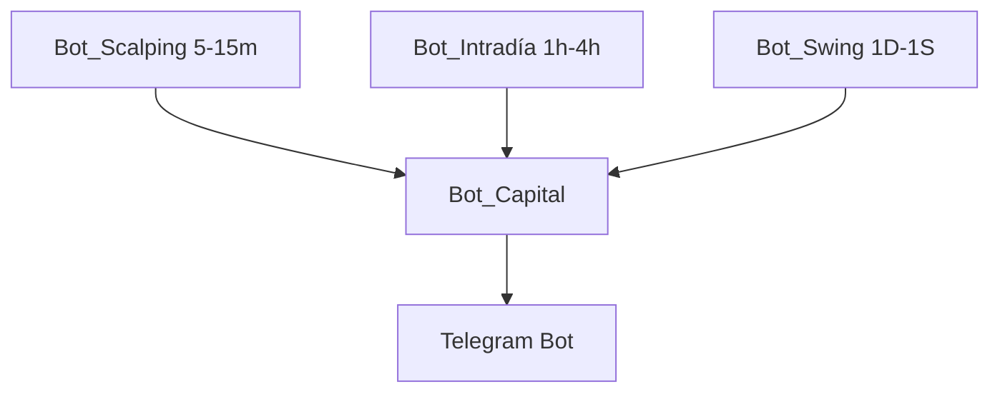

# 📡 Módulo de Trading > Telegram

Este módulo gestiona la comunicación vía **Telegram** para todo el sistema de bots de trading.  
Su función principal es centralizar reportes de los distintos módulos de trading y mostrarlos en un solo chat.

---

## 🚀 Arquitectura



- **Bot_Scalping** → genera señales rápidas (manual ahora, futuro Freqtrade).
- **Bot_Intradía** → genera señales en temporalidades medias.
- **Bot_Swing** → genera señales en temporalidades largas.
- **Bot_Capital** → centraliza todas las operaciones y balances.
- **Telegram Bot** → único canal de comunicación con el usuario.

---

## ⚙️ Configuración

1. Crear un bot en [BotFather](https://t.me/botfather).
2. Obtener el **TOKEN** y agregarlo en `.env`:
   ```env
   TELEGRAM_BOT_TOKEN=xxxxxxxxxxxxxxxx
   TELEGRAM_CHAT_ID=xxxxxxxxxxxx
   ```
3. Verificar que `telegram_helper.py` pueda enviar un mensaje de prueba:
   ```bash
   python Telegram/send_test.py
   ```

---

## 📂 Archivos principales

- `telegram_helper.py` → funciones para enviar mensajes.
- `alert_manager.py` → gestiona alertas desde otros módulos.
- `poll_bot.py` → permite interacción (futuro: encuestas/respuestas).
- `send_test.py` → script de prueba para verificar integración.

---

## 🧩 Integración con Bot_Capital

- Cada módulo (`scalping`, `intradia`, `swing`) envía señales o resultados.
- **Bot_Capital** registra en base de datos / CSV y reenvía reportes.
- **Telegram** muestra:
  - Señales nuevas
  - Estado de posiciones
  - Balance consolidado

---

## 🚦 Ejemplo de flujo de mensaje

1. Bot_Scalping detecta oportunidad.  
2. Envía señal a Bot_Capital.  
3. Bot_Capital la registra en el portafolio.  
4. Telegram muestra:
   ```
   [Scalping] Señal LONG en BTC/USDT @ 58,200
   Stop: 57,500
   Target: 59,200
   Balance actual: +2.4%
   ```

---

## 📌 Estado actual

- ✅ Envío de mensajes a Telegram funcionando.
- 🔄 Integración básica con `Bot_Capital` en progreso.
- ⏳ Futuro: órdenes automáticas hacia Freqtrade.

---
🔄 README actualizado
📡 Sistema de Notificaciones Telegram para Bots de Trading

Resumen: Centraliza todas las alertas y reportes de trading en un solo canal Telegram, usando AlertManager para evitar duplicados, manteniendo la lógica de señales intacta.

⚙️ Configuración

Crear bot en BotFather
 → obtener TOKEN y chat_id.

Guardar en .env:

TELEGRAM_BOT_TOKEN=xxxxxxxxxxxxxxxx
TELEGRAM_CHAT_ID=xxxxxxxxxxxx


Verificar el envío:

python3 -m Telegram.send_test

📂 Módulos Clave

telegram_helper.py: envía mensajes usando Config.

alert_manager.py: filtra alertas duplicadas con cooldown configurable.

send_test.py: prueba de conexión.

Bot_Capital/signals_handler.py: nuevo módulo para centralizar señales y enviarlas a Telegram pasando por AlertManager.

🧩 Flujo de Señales
flowchart TD
    A[Bot_X detecta señal] --> B[Bot_Capital recibe señal]
    B --> C{¿Se envió recientemente la misma señal?}
    C -- No --> D[AlertManager registra alerta]
    D --> E[telegram_helper.py envía mensaje a Telegram]
    C -- Sí --> F[Alerta ignorada por cooldown]
    E --> G[Usuario recibe notificación]


Cada bot genera señales (LONG, SHORT).

Bot_Capital las recibe y decide si registrarlas y enviarlas.

AlertManager filtra duplicados y aplica cooldown.

Telegram muestra solo alertas únicas, centralizadas por símbolo y temporalidad.

🚀 Beneficios

Separación de responsabilidades: trading y notificaciones independientes.

Evita spam gracias a AlertManager.

Escalable: se pueden agregar nuevos bots o temporalidades sin tocar la lógica central.

Centralización: todas las señales y balances en un solo chat.

Futuro ready: compatible con integración automática con Freqtrade u otros bots.
---
📡 Sistema de Notificaciones Telegram para Bots de Trading (Actualizado)

Este documento describe la integración completa de Telegram con AlertManager, Bot_Capital y poll_bot.py para notificaciones centralizadas y futuras interacciones.

🎯 Objetivo

Centralizar todas las alertas y reportes de los bots en un solo canal Telegram.

Evitar duplicados mediante AlertManager.

Mantener la lógica de señales intacta.

Permitir interactividad básica vía poll_bot.py.

Preparar futuras funcionalidades como encuestas, dashboards y ejecución automática de señales.

⚙️ Configuración

Crear bot en BotFather
 → obtener TOKEN y chat_id.

Guardar en .env:

TELEGRAM_BOT_TOKEN=xxxxxxxxxxxxxxxx
TELEGRAM_CHAT_ID=xxxxxxxxxxxx


Verificar el envío:

python3 -m Telegram.send_test


Ejecutar poll_bot.py desde la raíz:

python3 -m Telegram.poll_bot

📂 Módulos Clave
Módulo	Función	Estado
telegram_helper.py	Envía mensajes a Telegram usando Config	✅ Completado
alert_manager.py	Filtra alertas duplicadas y aplica cooldown	✅ Completado
send_test.py	Script de prueba para verificar Telegram	✅ Completado
signals_handler.py (Bot_Capital)	Recibe señales de cualquier módulo, pasa por AlertManager y envía a Telegram	🟡 En progreso
poll_bot.py	Escucha mensajes de usuarios, ejecuta comandos básicos (/start, /status, /help)	🟡 En progreso
🧩 Flujo de Señales y Comandos
flowchart TD
    subgraph Señales de Trading
        A[Bot_X detecta señal] --> B[Bot_Capital recibe señal]
    end
    subgraph Control de Alertas
        B --> C{¿Se envió recientemente la misma señal?}
        C -- No --> D[AlertManager registra alerta]
        D --> E[telegram_helper.py envía mensaje a Telegram]
        C -- Sí --> F[Alerta ignorada por cooldown]
        E --> G[Usuario recibe notificación]
    end
    subgraph Interactividad Usuario
        H[Usuario envía mensaje] --> I[poll_bot.py procesa comando]
        I --> J{Comando}
        J -- /start --> K[Mensaje bienvenida]
        J -- /status --> L[Últimas señales / balances]
        J -- /help --> M[Lista de comandos]
        J -- otros --> N[Eco / Respuesta genérica]
    end

🚀 Beneficios

Separación de responsabilidades: trading y notificaciones independientes.

Control de alertas duplicadas: evita spam en Telegram.

Escalable: fácil integración de nuevos bots o temporalidades.

Centralización: todas las señales y balances en un solo chat.

Futuro ready: compatible con integración automática con Freqtrade u otros bots.

🟡 Futuras Implementaciones de poll_bot.py

Consultas a Bot_Capital:

/status → mostrar últimas señales confirmadas, posiciones abiertas y balance consolidado en tiempo real.

/signals <símbolo> → filtrar por par específico.

/timeframe <1m|15m|1h> → filtrar por temporalidad.

Interactividad avanzada:

Inline buttons (InlineKeyboardMarkup) para ejecutar acciones rápidas.

Encuestas (polls) para votaciones o decisiones manuales.

Alertas personalizadas por usuario:

Permitir que varios usuarios reciban notificaciones solo de ciertos símbolos o bots.

Configuración de alertas individuales via comandos.

Manejo de errores y reconexión automática:

Reintentos en getUpdates si falla la conexión.

Logueo de errores en archivo para auditoría.

Dashboard resumido:

Reportes diarios/semanales enviados automáticamente vía Telegram.

Estadísticas históricas (ganancias/pérdidas, señales efectivas, etc.).

Integración futura con Freqtrade o ejecución automática:

Permitir que ciertos comandos disparen acciones de trading automatizadas.

Validar siempre señales confirmadas por AlertManager antes de ejecutar órdenes.
...
Telegram/
├── alert_manager.py                 # Gestión de alertas duplicadas y cooldown
├── Bot_Capital/
│   ├── api/
│   │   └── main.py                  # API REST con FastAPI
│   ├── core/
│   │   ├── portfolio.py             # Estado de cartera de prueba
│   │   └── signals.py               # Señales recientes de todos los bots
│   ├── __init__.py
│   └── signals_handler.py           # Lógica futura para manejo de señales
├── __init__.py
├── poll_bot.py                      # Bot que escucha comandos y envía alertas automáticas
├── send_test.py                     # Test de envío de mensajes a Telegram
├── telegram_checklist.md            # Checklist/documentación del módulo
├── telegram_helper.py               # Función segura para enviar mensajes usando Config
└── telegram_module_readme.md        # Documentación general del módulo

